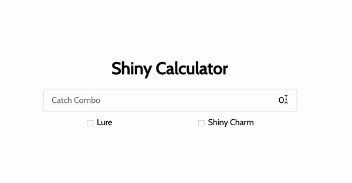

Shiny Calculator
================
Pokemon Let's Go probability calculator to compute the chances of the next spawn being a shiny pokemon. `+/- 0.01` margin of error.

**Resources**
- [Catch Combos](https://www.serebii.net/letsgopikachueevee/shinypokemon.shtml)
